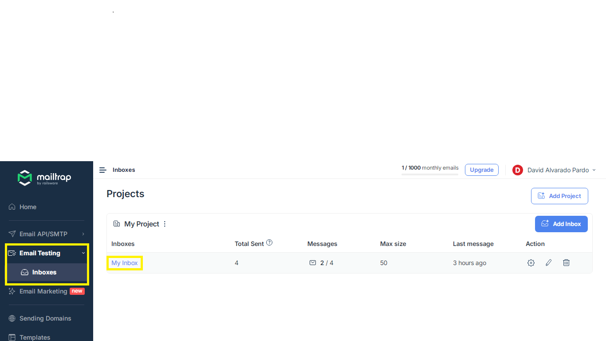
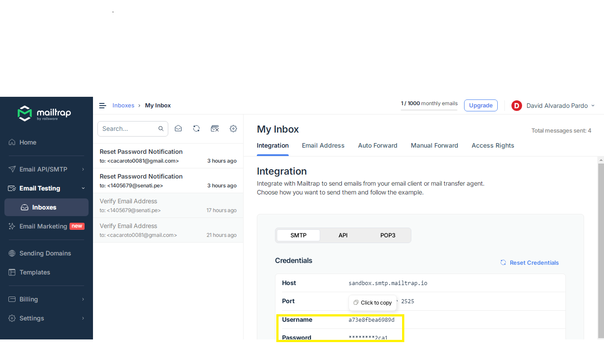
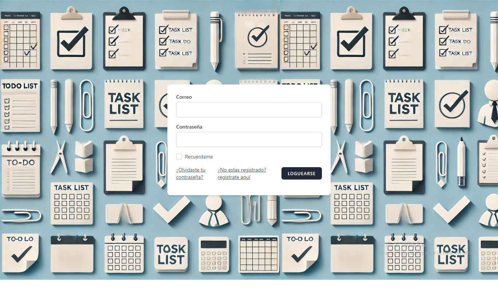
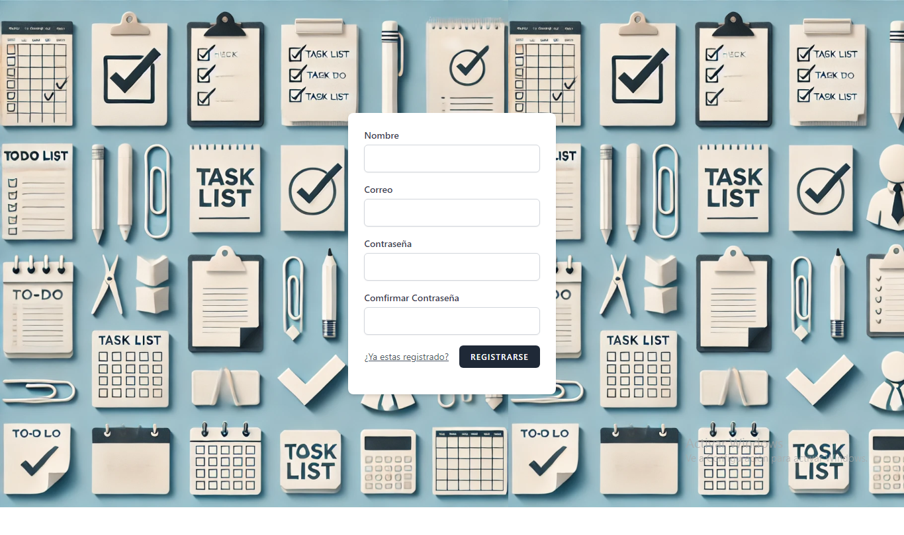
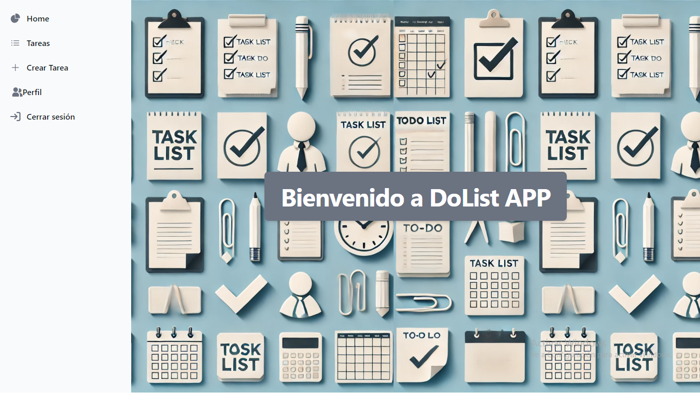
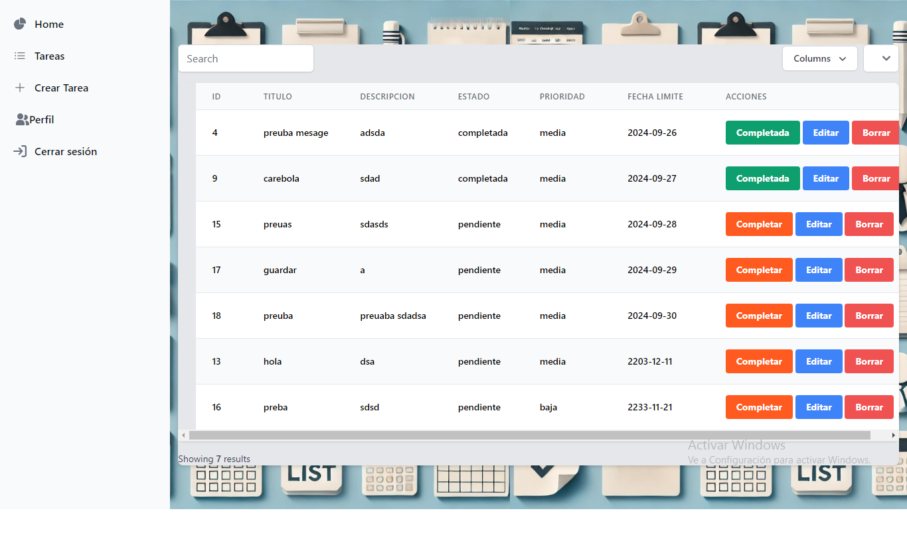
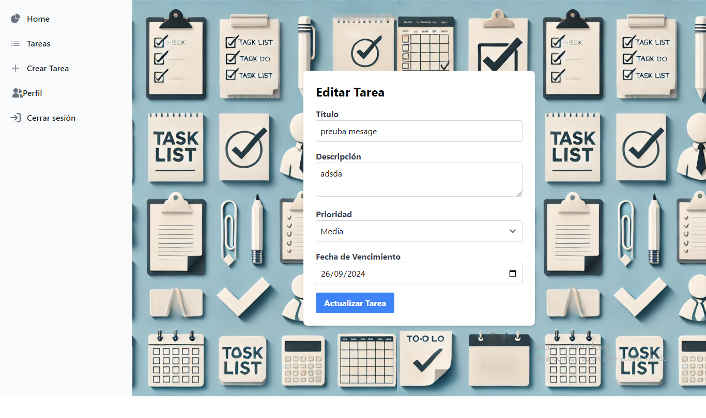
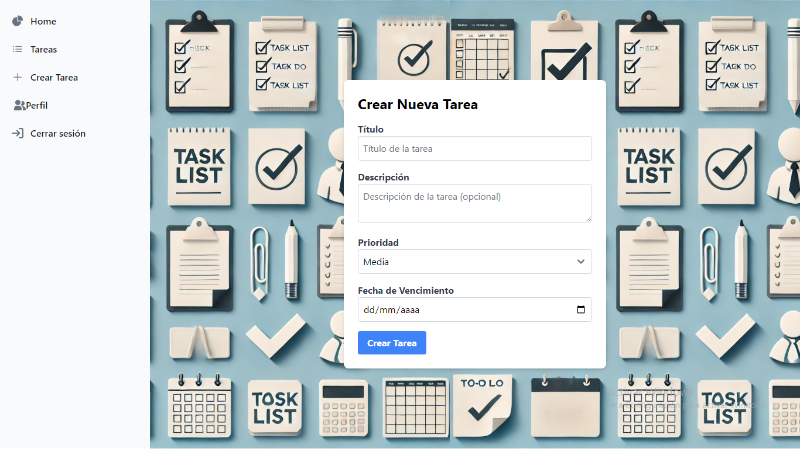
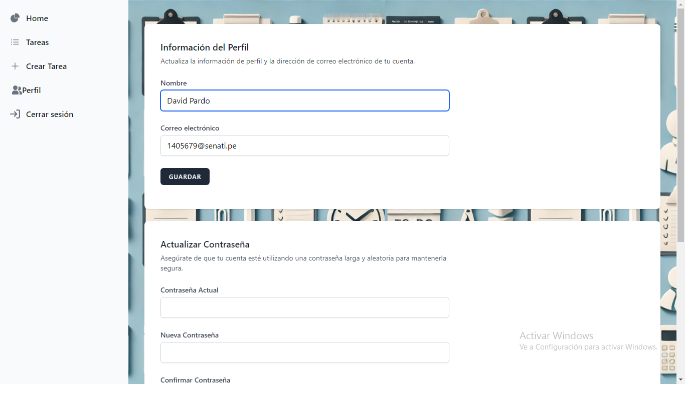
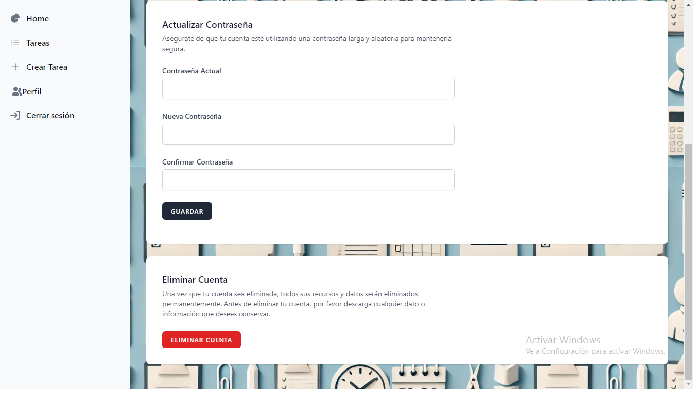

# TODO LIST APP
es un proyecto sobre un to do list de tareas con crud y verificacion de email.

## Requisitos

Asegúrate de tener instalados los siguientes software:

- [PHP](https://www.php.net/) (versión requerida)
- [Composer](https://getcomposer.org/)
- [Node.js](https://nodejs.org/) y [npm](https://www.npmjs.com/)

## Instalación

Sigue estos pasos para instalar el proyecto:

1. **Clona el repositorio:**

   ```bash
   git clone https://github.com/DavidPardon/do-list.git
   cd do-
   
2. **Instala las dependencias de PHP: Ejecuta el siguiente comando para instalar las dependencias con Composer:**

composer install
3. **Instala las dependencias de JavaScript: Ejecuta el siguiente comando para instalar las dependencias con npm:**

npm install

4. **Copia el archivo de entorno: Copia el archivo .env.example y renómbralo a .env:**

cp .env.example .env

5. **Genera la clave de la aplicación: Ejecuta el siguiente comando para generar la clave de la aplicación:**

php artisan key:generate

6. **Configura la base de datos: Abre el archivo .env y configura los detalles de tu base de datos (DB_CONNECTION, DB_HOST, DB_PORT, DB_DATABASE, DB_USERNAME, DB_PASSWORD).**
puedes dejarlo en sqlite:

DB_CONNECTION=sqlite
# DB_HOST=127.0.0.1
# DB_PORT=3306
# DB_DATABASE=laravel
# DB_USERNAME=root
# DB_PASSWORD=

7. **verificacion con email**
para este paso debera ir a la pagina de mailtrap y crearse una cuenta https://mailtrap.io/register/signup?ref=header, despues navega hasta my inbox como en esta imagen 
dale click al user para copiarlo y pegalo en el archivo .env 
MAIL_MAILER=smtp
MAIL_HOST=sandbox.smtp.mailtrap.io
MAIL_PORT=2525
MAIL_USERNAME= aqui
MAIL_PASSWORD= aqui
MAIL_ENCRYPTION=null
MAIL_FROM_ADDRESS="noreply@example.com"
MAIL_FROM_NAME="${APP_NAME}"
 donde dice MAIL_USERNAME
 lo mismo con la password de tu archivo .env


no cierre mailtrap porque ahi le llegaran los correos

7. **Ejecuta las migraciones: Para crear las tablas en la base de datos, ejecuta:**

php artisan migrate

8. **Inicia el servidor de desarrollo: Ejecuta el siguiente comando para iniciar el servidor:**

php artisan serve

Usage:
primero puedes loguearte pero primero debes registrarte si aun no lo estas

en el menu de registro llena todos los datos y le das al boton de registrar:

ahora que te logueaste estas en la pagina de inicio:

en la parte izquierda de la pagina tenemos la barra de navegacion, puedes dar click a tareas y se mostrara el listado de tareas:
tenemos la barra de buscar tambien hay paginado cuando pasas las 10 tareas registradas
tenemos un listado de tareas con los botones de completar que cambia el estado de la tarea a completada, tenemos el boton de editar para editar la tarea, y el boton de eliminar

la opcion de editar te muestra este formulario de editar la tarea:

en el navegador tenemos crear tarea en la cual puedes registar una nueva tarea:

en el navegador tenemos perfil en la cual puedes puedes editar tu perfil como el nombre, el email, cambiar contraseña y eliminar cuenta



